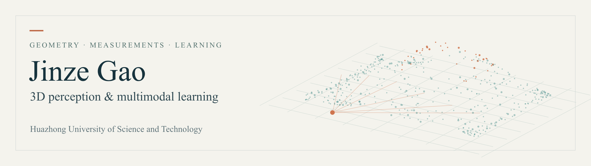
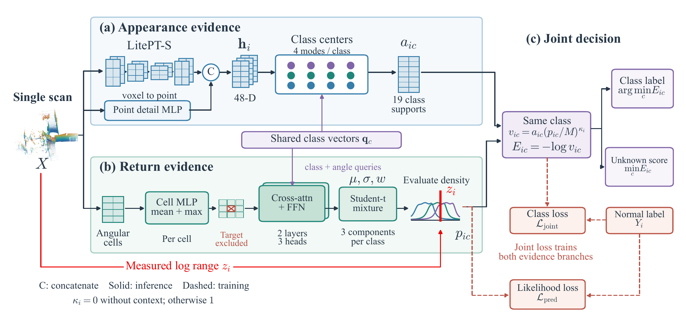
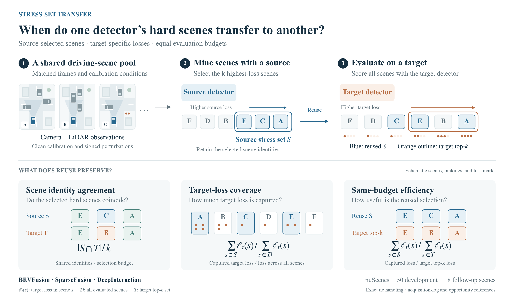

  

I am an undergraduate researcher in Automation at **Huazhong University of Science and Technology**, working with Prof. Jie Ma. I study how sensor geometry, physical measurements, and learned representations support 3D scene understanding.

My research spans LiDAR semantic segmentation, unknown-object detection, cross-model evaluation, and sensor calibration. I am also interested in persistent scene representations and future prediction for autonomous and embodied systems.

[**Website**](https://jasongao1010.github.io/) · [**Email**](mailto:u202315082@hust.edu.cn)

## Selected research

### [SERVE](https://github.com/JasonGao1010/SERVE)
**Semantic Evidence from Return Verification for LiDAR Segmentation**

A familiar semantic label should explain both a point's features and its measured range. SERVE combines feature support with a class-conditioned range distribution to study semantic segmentation and unknown-object detection in a single LiDAR scan. The range predictor excludes the target angular cell, so its prediction comes from surrounding measurements.

The method uses a three-component Student-t range model. Its training protocol uses **28,130 nuScenes scans** and **449 normal STU scans** for adaptation. The repository presents the method and a compact implementation of its core evidence computation.

[Method overview](https://github.com/JasonGao1010/SERVE) · [Selected code](https://github.com/JasonGao1010/SERVE/blob/main/evidence.py)

### [When does a model-mined stress set transfer?](https://github.com/JasonGao1010/stress-set-transfer)
**Utility- and reference-aware evaluation in 3D detection**

Hard scenes selected by one detector can expose different weaknesses in another. This study separates scene overlap, target-loss coverage, and fixed-budget utility across **BEVFusion, SparseFusion, and DeepInteraction**, using **2,007 nuScenes keyframes under 12 calibration perturbations** and a **725-keyframe follow-up** from separate recording logs.

At a **20% scene budget**, selecting between two source sets by raw scene overlap left a gap to the best target-specific selection. Missing target-relevant candidates accounted for **87.6–96.3%** of that mean utility gap across three loss definitions and both evaluation partitions. The repository connects this result to the analysis code and experimental protocol.

[Study and results](https://github.com/JasonGao1010/stress-set-transfer) · [Reproduction](https://github.com/JasonGao1010/stress-set-transfer/blob/main/REPRODUCE.md)

### Sensor geometry and calibration

In the Dongfeng–HUST vehicle-perception project, I investigated multi-fisheye and camera–LiDAR calibration, including explicit fisheye projection, observability checks, and joint SE(3) refinement. On a **four-camera synthetic benchmark with 3% corrupted correspondences**, robust refinement reduced median reprojection error from **7.469 to 0.411 pixels**.

[Project overview](https://jasongao1010.github.io/#calibration)

## Research direction

I am interested in how a scene representation can retain useful information through motion and occlusion, use new measurements to revise its geometric and semantic content, and predict what a sensor will observe next. This connects my work on measurement evidence and calibration with longer-term questions in spatiotemporal perception.

## Background

**B.Eng. in Automation, HUST** · Expected June 2027  
**Research:** Prof. Jie Ma's group · 3D perception and sensor geometry  
**Engineering experience:** PhiGent Robotics · Planning and control software; Lingang Laboratory · Multichannel signal processing
